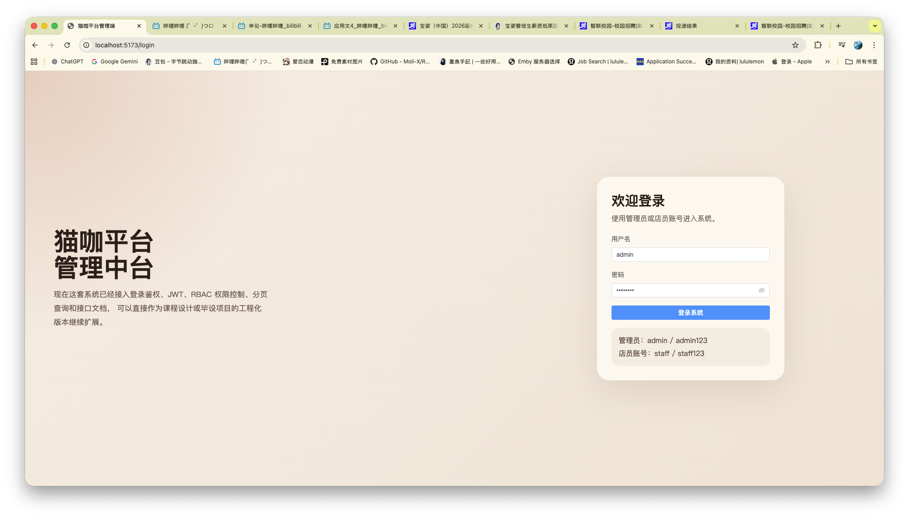
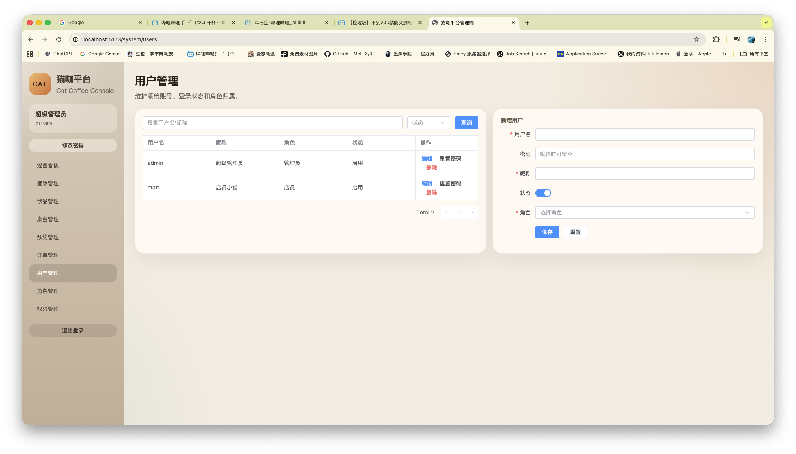
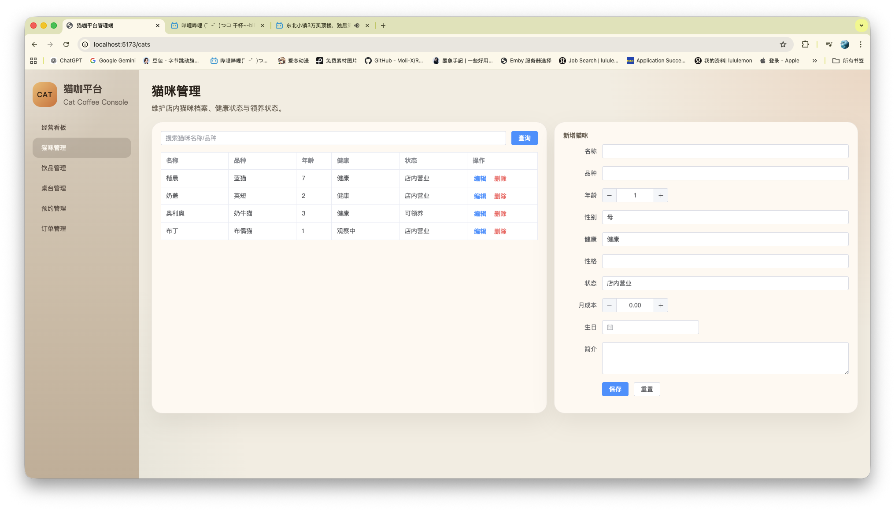

# Cat Coffee Management System

一个面向猫咖门店经营场景的前后端分离管理平台，围绕猫咪档案、饮品菜单、桌台资源、顾客预约、订单流转与系统权限治理构建完整业务闭环。项目基于 `Spring Boot 3 + MyBatis-Plus + MySQL + Vue 3 + Element Plus` 实现，并补齐了课程设计和工程化项目中常见的关键能力，包括 `JWT 登录鉴权`、`Refresh Token`、`RBAC 权限控制`、`分页查询`、`Swagger/OpenAPI 文档`、`系统管理`、`角色权限维护` 以及 `普通用户注册与前台预约/预定能力`。

该项目既可以作为课程设计、毕业设计、Java 全栈练手项目，也可以作为中小型门店后台系统原型继续扩展。

## Project Highlights

- 前后端分离架构：后端提供 RESTful API，前端独立承担页面渲染、路由守卫与交互逻辑
- 完整认证链路：支持登录、注册、刷新令牌、退出登录、修改本人密码、重置他人密码
- RBAC 权限模型：内置管理员、店员、普通用户三类角色，接口级权限控制与菜单级权限展示联动
- 业务模块闭环：涵盖猫咪、饮品、桌台、预约、订单、系统管理等核心模块
- 工程化接口规范：统一返回体、统一异常处理、统一分页结构、Swagger 在线调试
- 权限变更即刻生效：角色、权限、用户分配发生变化后，自动使受影响用户的旧 token 失效
- 双端视角兼顾：既支持后台经营管理，也支持普通用户浏览猫咪、浏览饮品、到店预约与饮品预定

## Preview

### 登录 / 注册页



### 系统管理页



### 业务模块页



## Business Modules

### 门店经营端

- 经营看板：统计猫咪数量、预约量、活跃订单数、今日营收、热销饮品等核心经营指标
- 猫咪管理：维护猫咪名称、品种、年龄、健康状态、性格标签、领养状态、喂养成本、生日与介绍
- 饮品管理：维护饮品分类、售价、库存、销量、推荐状态、上下架状态
- 桌台管理：维护桌号、区域、桌台容量、桌位状态与备注信息
- 预约管理：维护预约客户信息、桌台分配、预约状态与到店流转
- 订单管理：支持散客下单与预约关联下单，自动汇总订单金额并扣减饮品库存
- 系统管理：支持用户管理、角色管理、权限管理、表单校验、确认弹窗、抽屉式新增编辑交互

### 普通用户端

- 用户注册：支持普通用户注册后自动分配默认角色并直接登录
- 猫咪浏览：浏览店内猫咪档案与状态信息
- 饮品菜单：查看可售饮品及价格信息
- 到店预约：选择预约时间、桌台与人数发起预约
- 饮品预定：选择饮品、桌台和数量发起订单

## Technical Architecture

### Backend

- `Spring Boot 3.3.4`
- `Spring Security`
- `MyBatis-Plus 3.5.7`
- `MySQL 8`
- `JJWT 0.12.6`
- `Spring Validation`
- `Springdoc OpenAPI / Swagger UI`

### Frontend

- `Vue 3.5`
- `Vue Router 4`
- `Axios`
- `Element Plus`
- `Vite 4`

### Core Engineering Capabilities

- JWT Access Token + Refresh Token 双令牌方案
- 基于角色与权限编码的 RBAC 访问控制
- 前端路由守卫 + 权限菜单过滤
- 后端接口级鉴权与统一异常返回
- MyBatis-Plus 分页封装与逻辑删除
- Swagger 在线接口文档与参数注解美化
- 用户、角色、权限数据联动维护

## Permission Design

项目当前预置三类角色：

- `admin`：超级管理员，拥有全部业务与系统管理权限
- `staff`：店员，拥有日常经营操作权限，但不具备高危系统管理能力
- `user`：普通用户，拥有猫咪浏览、饮品浏览、到店预约、饮品预定等前台能力

权限调整后，系统会自动提升受影响用户的 `token_version`，使旧登录态立即失效，避免出现“页面已更新、接口仍使用旧权限”的割裂问题。

## Project Structure

```text
Cat-Coffee-Management-System
├── backend                      # Spring Boot 后端服务
│   ├── src/main/java
│   └── src/main/resources
├── frontend                     # Vue 3 前端应用
│   ├── src
│   └── public
├── sql
│   └── cat_coffee.sql           # 数据库脚本与初始化数据
├── docs
│   └── screenshots              # README 展示截图
├── .gitignore
└── README.md
```

## Typical Workflow

### 登录认证流程

1. 用户通过登录或注册接口获取 `accessToken` 与 `refreshToken`
2. 前端将访问令牌写入本地存储，并在请求拦截器中自动携带
3. 当访问令牌失效时，前端自动使用 `refreshToken` 换取新令牌
4. 当用户退出登录、修改密码、角色变化或权限变化时，旧 token 自动失效

### 订单处理流程

1. 用户或店员选择桌台并添加饮品明细
2. 后端按饮品数量和单价汇总订单总金额
3. 系统自动写入订单主表与订单明细表
4. 对应饮品库存自动扣减，形成闭环

## API Overview

### 认证中心

- `POST /api/v1/auth/login`：账号登录
- `POST /api/v1/auth/register`：普通用户注册
- `POST /api/v1/auth/refresh`：刷新访问令牌
- `POST /api/v1/auth/logout`：退出登录
- `GET /api/v1/auth/me`：获取当前用户信息
- `POST /api/v1/auth/password/change`：修改本人密码

### 业务接口

- `GET /api/v1/dashboard`
- `GET /api/v1/cats`
- `POST /api/v1/cats`
- `DELETE /api/v1/cats/{id}`
- `GET /api/v1/drinks`
- `POST /api/v1/drinks`
- `DELETE /api/v1/drinks/{id}`
- `GET /api/v1/tables`
- `POST /api/v1/tables`
- `DELETE /api/v1/tables/{id}`
- `GET /api/v1/reservations`
- `POST /api/v1/reservations`
- `DELETE /api/v1/reservations/{id}`
- `GET /api/v1/orders`
- `POST /api/v1/orders`
- `DELETE /api/v1/orders/{id}`

### 系统管理接口

- `GET /api/v1/system/users`
- `POST /api/v1/system/users`
- `DELETE /api/v1/system/users/{id}`
- `POST /api/v1/system/users/{id}/reset-password`
- `GET /api/v1/system/roles`
- `POST /api/v1/system/roles`
- `DELETE /api/v1/system/roles/{id}`
- `GET /api/v1/system/permissions`
- `POST /api/v1/system/permissions`
- `DELETE /api/v1/system/permissions/{id}`

## Pagination Convention

所有列表接口统一支持如下分页参数：

- `current`：当前页码，默认 `1`
- `size`：每页条数，默认 `10`

统一返回结构示例：

```json
{
  "code": 200,
  "message": "success",
  "data": {
    "current": 1,
    "size": 10,
    "total": 3,
    "records": []
  }
}
```

## Quick Start

### 1. 初始化数据库

执行 [sql/cat_coffee.sql](sql/cat_coffee.sql) 脚本，创建数据库、表结构与初始化数据。

```sql
source /绝对路径/sql/cat_coffee.sql;
```

### 2. 启动后端

后端配置文件位于 `backend/src/main/resources/application.yml`，默认数据库连接如下：

- 数据库：`cat_coffee`
- 用户名：`root`
- 密码：`123456`
- 端口：`8080`

启动命令：

```bash
cd backend
mvn spring-boot:run
```

Swagger 文档地址：

- [http://localhost:8080/swagger-ui.html](http://localhost:8080/swagger-ui.html)

### 3. 启动前端

```bash
cd frontend
pnpm install
pnpm dev
```

前端访问地址：

- [http://localhost:5173](http://localhost:5173)

## Default Accounts

- 管理员：`admin / admin123`
- 店员：`staff / staff123`
- 普通用户：`user / user123`

## Engineering Notes

- 后端已实现统一返回对象 `ApiResponse`
- 后端已实现统一异常处理与权限异常处理
- 登录页已支持登录 / 注册双模式
- 系统管理页已支持表单校验、确认弹窗、密码重置与抽屉式编辑
- 前端接口层已实现自动刷新 token
- 普通用户角色已具备预约与预定业务能力

## Future Enhancements

- 接入图片上传与对象存储，完善猫咪头像与饮品图片
- 为普通用户增加“我的预约 / 我的订单”专属视图
- 引入图表库完善经营分析面板
- 增加会员积分、优惠券、评价与活动营销能力
- 增加单元测试、接口测试与部署脚本

## License

本项目当前用于学习、课程设计与作品集展示场景，可根据需要进一步补充开源协议。
